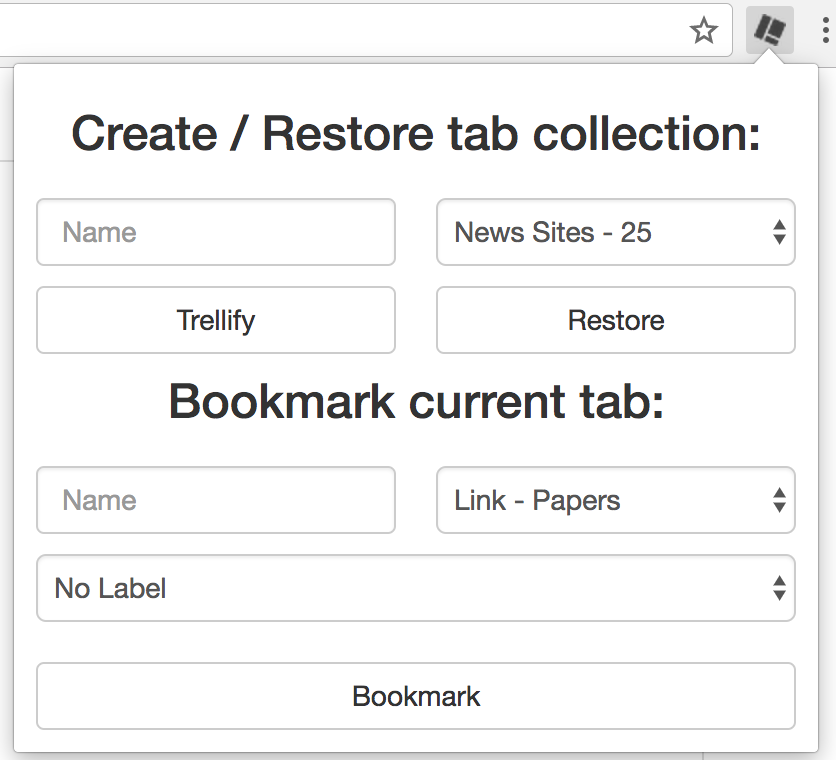

# Trellify Tabs

**Chrome extension to create collections of tabs that are saved and restored from  [Trello](https://trello.com). Ability to bookmark single tab**

Not quite ready to be put in the chrome app store (Getting closer)

## TODO
- [ ] Add options page
  - [x] To allow configuration of board and list that the tab cards are be added to
  - [x] To go through auth flow and save in local storage
  - [x] To give ability to leave tabs open when trellified
  - [x] To give ability to turn of either bookmarking section or trellify section
  - [x] Ability to disable tab usage 
- [ ] Check that a name for the tab set has been given or auto populate with date / time
- [x] Improve design (html, css)
- [x] Ability to bookmark current tab
- [ ] Ability to see that the page has already been bookmarked

## Usage

To use the extension in the current form.

Download the source

Run bower
```bash
bower install
```

Modify trellifyBackground.js

```javascript
localStorage.trellifyApiKey = 'DEVELOPER_API_KEY_HERE';
```

To insert your developer API key.

To get a trello developer API key go [here](https://trello.com/app-key)

Go to chrome://extensions in Chrome with developer mode ticked click load unpacked extension and navigate to the TrellifyTabs directory.

Once you have added the extension to Chrome the options page will display allowing you to authorize your trello account and set which board list you would like to save tabs too.
